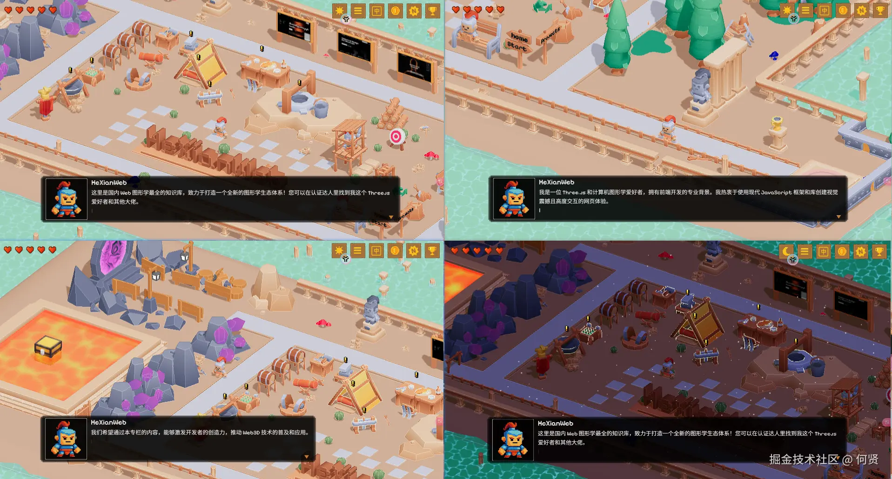
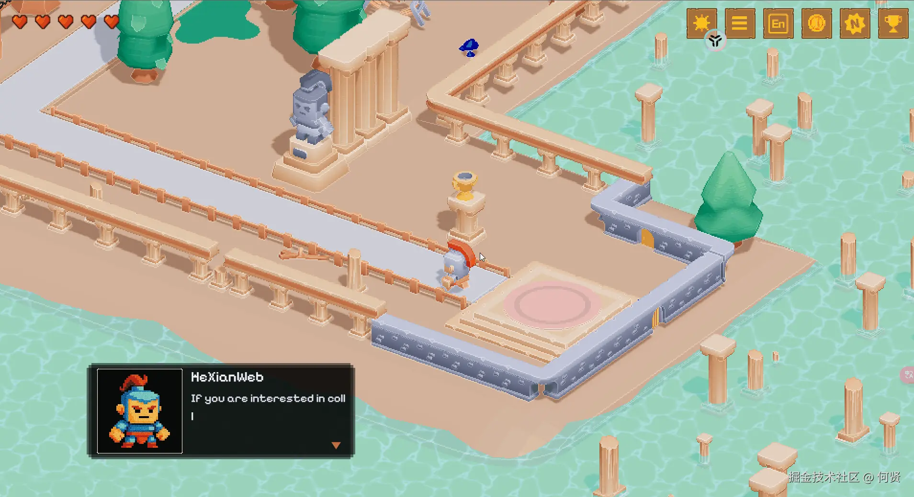

# 🕹️ 2.5D 像素风 Three.js 交互式个人简历 | 2.5D Pixel Art Three.js Interactive Resume

<div align="center">

[](https://threejs.org/)
[](https://vitejs.dev/)
[](https://tailwindcss.com/)
[](https://playwright.dev/)
[](https://opensource.org/licenses/MIT)

[**中文版**](#-项目简介) | [**English**](#-project-introduction)

</div>

---

## 🎨 项目预览 | Preview

### 🖥️ 桌面端预览 | Desktop View


### 📱 移动端预览 | Mobile View


---

## 📖 项目简介

本项目是一个基于 **Three.js** 开发的 **2.5D 像素风格交互式个人简历网站**。它将传统的简历信息（如个人简介、项目经历、技能特长、生活爱好等）融入到一个 3D 像素风游戏场景中。用户可以通过控制像素角色探索岛屿，在与不同场景区域互动的过程中逐步解锁并查看内容，兼具趣味性、观赏性与交互性，并优先优化了移动端的触控操作与加载速度。

---

## 📖 Project Introduction

This project is an interactive **2.5D pixel-style resume website** built with **Three.js**. It gamifies the presentation of personal information, projects, skills, and hobbies within a 3D pixelated island. Users control a pixel character to explore the scene, triggering interactive dialogs and collectible objects. Developed with a mobile-first approach, it features optimized touchscreen controls, responsive interfaces, and fast asset preloading.

---

## ✨ 主要特性 | Key Features

*   🕹️ **2.5D 像素风 3D 场景 / 2.5D Pixel Art Scene**: 结合 3D 渲染与复古像素风材质贴图，支持自由转动与透视调整。
*   🏃 **角色控制系统 / Character Control**: 使用 WASD 或方向键控制像素角色移动与跳跃，并配有动作动画（站立、跑步、坐下等）。
*   💬 **动态对话框交互 / Dynamic Dialogues**: 靠近场景中的特定地标（床、工作台、武器架、水井等）时会自动弹出悬浮提示（CSS2DRenderer），按下 F 键即可使用 `typed.js` 进行中英文打字机式对话交互。
*   🌗 **昼夜切换系统 / Day-Night Shift**: 支持一键切换白天与黑夜模式，实时调整光源（半球光、环境光、平行光）、阴影以及天空盒的天空纹理。
*   🌐 **多语言支持 / Multilingual Support**: 完美支持中英文（zh/en）一键切换，所有的文本引导、对话内容及指引均实现本地化。
*   📱 **全面移动端优化 / Mobile-First Optimization**: 针对手机等触摸屏设备进行了布局重构，优化了按键大小和手势交互，并利用 `tweakpane` 调试面板支持多端检测。
*   ⚙️ **物理与碰撞检测 / Physics & Collision**: 采用 `three/addons/math/Octree`（八叉树）与 `Capsule`（胶囊体）对 3D 场景几何体进行高效的物理碰撞判定，防止角色穿墙或掉落地图。

---

## 🛠️ 技术栈 | Tech Stack

*   **3D 引擎**: [Three.js](https://threejs.org/) (r172) - 核心 3D 渲染与场景构建。
*   **物理碰撞**: Three.js Addons `Octree` & `Capsule` - 场景碰撞体判定。
*   **构建工具**: [Vite](https://vitejs.dev/) (v5.4.0) - 极速冷启动与热更新的前端构建器。
*   **动画库**: [GSAP](https://greensock.com/gsap/) (v3.12.5) - 用于平滑的相机机位过渡及 UI 动效。
*   **样式库**: [TailwindCSS](https://tailwindcss.com/) (v3.4.9) & [SASS](https://sass-lang.com/) (v1.77.8) - 原子化 CSS 与像素风边框动画。
*   **测试框架**: [Playwright](https://playwright.dev/) (v1.46.0) - 自动化端到端 (E2E) 浏览器渲染测试。
*   **其他组件**: [typed.js](https://mattboldt.github.io/typed.js/) (打字机效果)、[tweakpane](https://cocopon.github.io/tweakpane/) (开发期调试面板)、[partytown](https://partytown.builder.io/) (多线程优化)。

---

## 📂 目录结构与核心架构 | Architecture & Structure

项目基于 **Singleton-based Modular Game Loop Pattern (单例模块化游戏循环模式)** 构建，其核心架构如下：

```
[project-root]/
├── .planning/             # GSD 规划与项目上下文设计图纸
├── public/                # 静态资源 (3D模型 .glb, 材质纹理, 动作图标)
│   ├── models/            # character-soldier.glb, scene.glb, collision-world.glb
│   └── textures/          # day.webp, night.webp, noise/
├── src/                   # 源代码
│   ├── css/ & scss/       # global.css & 像素风格 SCSS
│   ├── shaders/           # 熔岩 (lava)、海洋 (ocean) 及传送门 (portal) 的自定义 GLSL Shader
│   └── js/
│       ├── index.js       # 入口文件，挂载 canvas，初始化指引与对话
│       ├── experience.js  # 核心单例 (Experience)，协调着渲染器、相机、时间和大小重置
│       ├── camera.js      # 视角相机，包含 OrbitControls 轨道控制器
│       ├── renderer.js    # WebGL 渲染器，管理渲染通道与后处理
│       ├── i18n/          # translations.js 语言字典，i18nManager.js 管理器
│       ├── utils/         # time.js (Tick 更新循环), resources.js (资源预加载), sizes.js
│       └── world/         # 3D 实体 (hero.js, world.js, environment.js, eventPointManager.js)
```

---

## 🕹️ 游戏操作指南 | Game Controls

| 按键 / Action | 功能 (中文) | Function (English) |
|:---:|---|---|
| **W / A / S / D** <br> 或 **↑ / ↓ / ← / →** | 控制角色在岛屿上移动 | Move the character around the island |
| **SPACE** (空格键) | 控制角色跳跃 | Make the character jump |
| **F** | 靠近交互点后触发对话与区域介绍 | Interact with target area (Dialogues) |
| **R** | 重置角色位置 (卡地形时使用) | Reset character position if stuck |

### 📍 交互区域一览 | Interactive Zones
*   **休息区 (`bed_area`)**: 个人简历简介与背景介绍。
*   **收藏区 (`beer_area`)**: 收藏品与个人主页导航。
*   **技能区 (`workbench_area`) / (`kitchen_area`)**: 掌握的技术栈、前端与 3D 图形学知识点。
*   **项目区 (`weapon_area`)**: 实战项目经历与武器装备展示。
*   **生活区 (`dining_area`)**: 兴趣爱好与日常生活分享。
*   **联络区 (`well_area`)**: WeChat, Email 及社区联系方式。

---

## 🚀 快速开始 | Getting Started

### 环境要求 / Prerequisites
- [Node.js](https://nodejs.org/) (推荐 v18+)
- 推荐使用 [Yarn](https://yarnpkg.com/)

### 1. 克隆仓库与安装依赖 | Install
```bash
git clone https://github.com/doinel1a/vite-three-js.git
cd island
yarn install
```

### 2. 启动本地开发服务器 | Dev
```bash
yarn dev
```
运行后访问：`http://localhost:3000`。
*提示：在 URL 后面添加 `#debug` 即可打开 Tweakpane 实时场景调试面板。*

### 3. 构建生产环境 | Build
```bash
yarn build
```
打包生成的文件将位于 `dist/` 目录中，可直接部署至任何静态服务器（如 Vercel, GitHub Pages, Netlify 等）。

### 4. 运行端到端测试 | E2E Tests
```bash
# 运行 Chrome 浏览器测试
yarn test:chrome

# 运行 Firefox 浏览器测试
yarn test:firefox
```

---

## 🤝 贡献指南 | Contributing

欢迎任何形式的贡献和反馈！

1. Fork 本仓库并创建一个新的分支 (`feature/amazing-feature`)。
2. 提交更改，并遵循 [Conventional Commits](https://www.conventionalcommits.org/) 规范撰写 Commit Message。
3. 提交 Pull Request，等待 Review 并合并。

---

## 📝 许可证 | License

本项目基于 **MIT License** 开源。

---

> 💡 **致谢 / Credits**
> - 场景模型主要源于 [Kenney.nl](https://kenney.nl/) 的公开素材以及 Hyper3D AI 生成。
> - 部分插图和 2D 贴图资产由 GPT-4o 生成。
> - 本项目灵感来源于像素风 RPG 游戏与交互式创意简历。欢迎加微信 `hexianWeb` 或发送邮件至 `hexianweb@gmail.com` 共同探讨交流！
